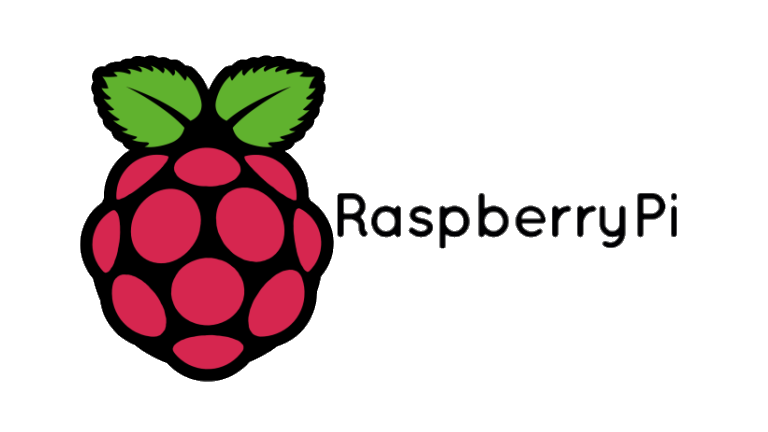
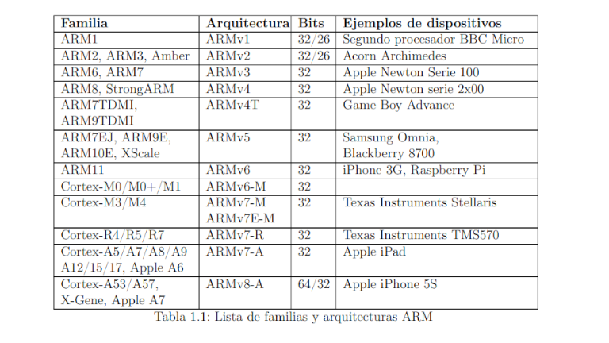
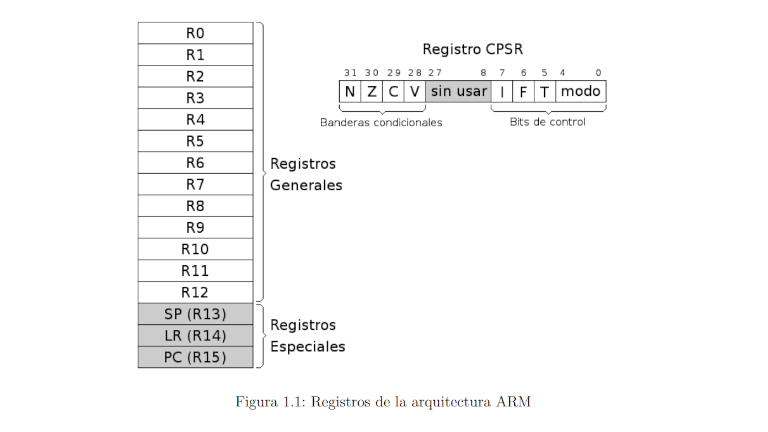
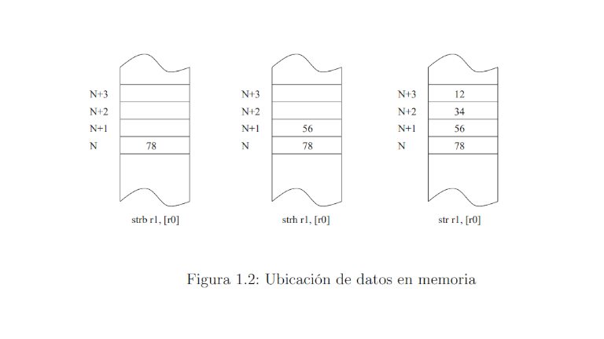
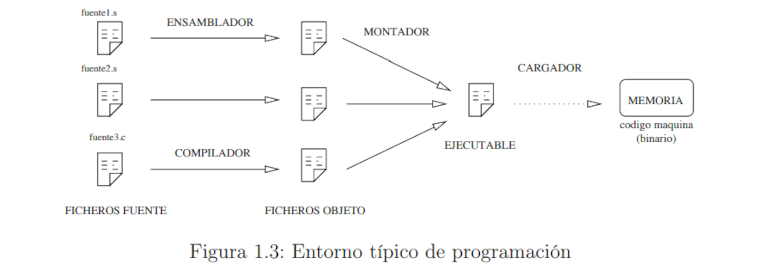
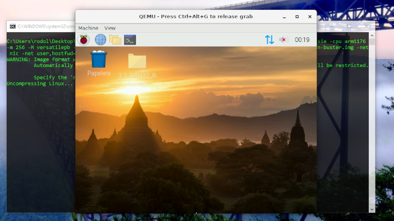
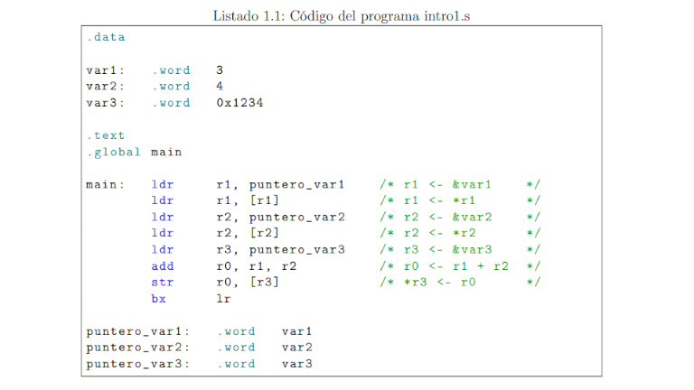
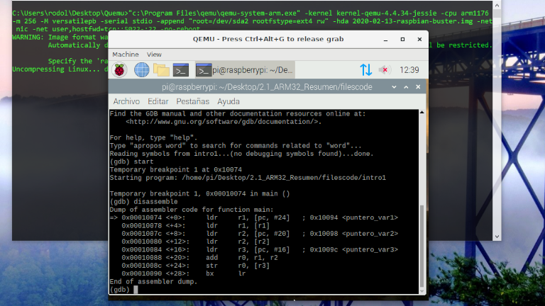

## Tecnológico Nacional de México
## Instituto Tecnológico de Tijuana
## Subdirección Académica

### Departamento de Sistemas y Computación
### Ingeniería en Sistemas Computacionales

<br></br>
## Lenguajes de interfaz 
## Practica Bloque:  2
## Objetivo: Resumen de ARM32 del ebook OpenSource 

<br></br>
### 📝 Nombre: Zamora Lopez Rodolfo #18210544
   
<br></br>
### Profesor:
### MC. René Solis Reyes
### Semestre sep - ene 2020
-----
<br></br>

# Resumen de ARM32 del ebook OpenSource

<br></br>

## Conociendo Raspberry Pi

Raspberry Pi es un proyecto originalmente pensado para que los estudiantes de las diversas instituciones y niveles académicos pudieran tener acceso a una pequeña computadora y poder realizar diversas actividades en ella así como la compresión de la misma. Esto brinda la posibilidad de tener un acceso económico a un dispositivo que podemos considerar como un computador (en pequeña escala por supuesto) con todas las funcionalidades de este.  Aunque hoy en día la popularidad de la placa Raspberry Pi ha sido tan grande que se le han dado diversos usos, por mencionar algunos encontramos servidores ligeros para el almacenamiento de datos, servidores multimedia, computadores portátiles (muy portátiles) entre muchos otros ejemplos.
  


> *Logo oficial de Raspberry Pi*

<br></br>

## Capítulo 1: Introducción a ensamblador “Conociendo el entorno de trabajo”
En este primer capítulo vamos abordar una introducción sobre lo que es ARM, la como es su arquitectura, y las herramientas necesarias para poder trabajar con ensamblador sobre esta arquitectura.

ARM es una arquitectura RISC (Reduced Instruction Set Computer=Ordenador
con Conjunto Reducido de Instrucciones) de 32 bits, salvo la versión del core ARMv8-
A que es mixta 32/64 bits (bus de 32 bits con registros de 64 bits). Se trata de una
arquitectura licenciable, quiere decir que la empresa desarrolladora ARM Holdings
diseña la arquitectura, pero son otras compañías las que fabrican y venden los chips,
llevándose ARM Holdings un pequeño porcentaje por la licencia.



<br></br>

### Registros
La arquitectura ARMv6 presenta un conjunto de 17 registros (16 principales más uno de estado) de 32 bits cada uno.



**Registros Generales.** Su función es el almacenamiento temporal de datos. Son los
13 registros que van R0 hasta R12.

**Registros Especiales.** Son los últimos 3 registros principales: R13, R14 y R15.
Como son de propósito especial, tienen nombres alternativos.

* **SP/R13. Stack Pointer ó Puntero de Pila.** Sirve como puntero para almacenar variables locales y registros en llamadas a funciones.
* **LR/R14. Link Register ó Registro de Enlace.** Almacena la dirección de
retorno cuando una instrucción BL ó BLX ejecuta una llamada a una
rutina.
* **PC/R15. Program Counter ó Contador de Programa.** Es un registro que
indica la posición donde está el procesador en su secuencia de instrucciones. Se incrementa de 4 en 4 cada vez que se ejecuta una instrucción,
salvo que ésta provoque un salto.

**Registro CPSR.** Almacena las banderas condicionales y los bits de control. Los
bits de control definen la habilitación de interrupciones normales (I), interrupciones rápidas (F), modo Thumb(T) y el modo de operación de la CPU.

<br></br>
### Esquema de almacenamiento
El procesador es Bi-Endian, quiere decir que es configurable entre Big Endian y
Little Endian. Aunque nuestro sistema operativo nos limita a Little Endian.
Por tanto la regla que sigue es “el byte menos significativo ocupa la posición más
baja”. Cuando escribimos un dato en una posición de memoria, dependiendo de si
es byte, half word o word,... se ubica en memoria según el esquema de la figura 1.2.
La dirección de un dato es la de su byte menos significativo. La memoria siempre se
referencia a nivel de byte, es decir si decimos la posición N nos estamos refiriendo
al byte N-ésimo, aunque se escriba media palabra, una palabra...




### El lenguaje ensamblador
El ensamblador es un lenguaje de bajo nivel que permite un control directo de
la CPU y todos los elementos asociados. Cada línea de un programa ensamblador
consta de una instrucción del procesador y la posición que ocupan los datos de esa
instrucción.
Desarrollar programas en lenguaje ensamblador es un proceso laborioso. El procedimiento es similar al de cualquier lenguaje compilado. Un conjunto de instrucciones
y/o datos forman un módulo fuente. Este módulo es la entrada del compilador, que
chequea la sintaxis y lo traduce a código máquina formando un módulo objeto. Finalmente, un enlazador (montador ó linker) traduce todas las referencias relativas a
direcciones absolutas y termina generando el ejecutable.

- Operaciones que se repitan un número elevado de veces.
- Cuando se requiera una gran velocidad de proceso.
- Para utilización y aprovechamiento de dispositivos y recursos del sistema.

 <br></br>
### El entorno
Los pasos habituales para hacer un programa (en cualquier lenguaje) son los siguientes: lo primero es escribir el programa en el lenguaje fuente mediante un editor de programas. El resultado es un fichero en un lenguaje que puede entender el usuario, pero no la máquina. Para traducirlo a lenguaje máquina hay que utilizar un programa traductor. Éste genera un fichero con la traducción de dicho programa, pero todavía no es un programa ejecutable. Un fichero ejecutable contiene el programa traducido más una serie de códigos que debe tener todo programa que vaya a ser ejecutado en una máquina determinada. Entre estos códigos comunes se encuentran las librerías del lenguaje. El encargado de unir el código del programa con el código de estas librerías es un programa llamado montador (linker) que genera el programa ejecutable


 
 <br></br>

### Configuración del entorno para realizar las prácticas en casa
Para el entorno  de trabajo vamos utilizar un emulador, concretamente QEMU ejecutando Raspberry PI OS. No agrego los detalles de instalación porque todo viene en el libro de referencia. La única razón para su mención es por su importancia en esta redacción y pruebas. Todos los pasos necesarios para la descarga, instalación y configuración se siguierón a detalle paso por paso como lo indico el libro de referencia.



> *QEMU en ejecución con Raspberry Pi OS*

<br></br>

### Aspecto de un programa en ensamblador

En el listado 1.1 se muestra el código de la primera práctica que probaremos. En
el código hay una serie de elementos que aparecerán en todos los programas y que
estudiaremos a continuación.



La principal característica de un módulo fuente en ensamblador es que existe
una clara separación entre las instrucciones y los datos. La estructura más general
de un módulo fuente es:

* **Sección de datos.** Viene identificada por la directiva .data. En esta zona se
definen todas las variables que utiliza el programa con el objeto de reservar
memoria para contener los valores asignados. Hay que tener especial cuidado
para que los datos estén alineados en palabras de 4 bytes, sobre todo después
de las cadenas. Alinear significa rellenar con ceros el final de un dato para que
el siguiente dato comience en una dirección múltiplo de 4 (con los dos bits
menos significativos a cero). Los datos son modificables.

* **Sección de código.** Se indica con la directiva .text, y sólo puede contener código
o datos no modificables. Como todas las instrucciones son de 32 bits no hay
que tener especial cuidado en que estén alineadas. Si tratamos de escribir en
esta zona el ensamblador nos mostrará un mensaje de error

De estas dos secciones la única que obligatoriamente debe existir es la sección .text (o sección de código). En el ejemplo 1.1 comprobamos que están las dos. Un módulo fuente, como el del ejemplo, está formado por instrucciones, datos, símbolos y directivas. Las instrucciones son representaciones nemotécnicas del juego de instrucciones del procesador. Un dato es una entidad que aporta un valor numérico, que puede expresarse en distintas bases o incluso a través de una cadena. Los símbolos son representaciones abstractas que el ensamblador maneja en tiempo de ensamblado pero que en el código binario resultante tendrá un valor numérico concreto. Hay tres tipos de símbolos: las etiquetas, las macros y las constantes simbólicas. Por último tenemos las directivas, que sirven para indicarle ciertas cosas al ensamblador, como delimitar secciones, insertar datos, crear macros, constantes simbólicas, etc... Las instrucciones se aplican en tiempo de ejecución mientras que las directivas se aplican en tiempo de ensamblado. 


#### Datos
Los datos se pueden representar de distintas maneras. Para representar números tenemos 4 bases. La más habitual es en su forma decimal, la cual no lleva ningún delimitador especial. Luego tenemos otra muy útil que es la representación hexadecimal, que indicaremos con el prefijo 0x. Otra interesante es la binaria, que emplea el prefijo 0b antes del número en binario. La cuarta y última base es la octal, que usaremos en raras ocasiones y se especifica con el prefijo 0. Sí, un cero a la izquierda de cualquier valor convierte en octal dicho número. Por ejemplo 015 equivale a 13 en decimal. Todas estas bases pueden ir con un signo menos delante, codificando el valor negativo en complemento a dos. Para representar carácteres y cadenas emplearemos las comillas simples y las comillas dobles respectivamente. 


#### Símbolos
Como las etiquetas se pueden ubicar tanto en la sección de datos como en la de código, la versatilidad que nos dan las mismas es enorme. En la zona de datos, las etiquetas pueden representar variables, constantes y cadenas. En la zona de código podemos usar etiquetas de salto, funciones y punteros a zona de datos. Las macros y las constantes simbólicas son símbolos cuyo ámbito pertenece al preprocesador, a diferencia de las etiquetas que pertenecen al del ensamblador. Se especifican con las directivas .macro y .equ respectivamente y permiten que el código sea más legible y menos repetitivo. 

 <br></br>

## Ensamblar y linkar un programa
La traducción o ensamblado de un módulo fuente (nombreprograma.s) se realiza con el programa Gnu Assembler, con el siguiente comando:

```bash
as -o nombreprograma.o nombreprograma.s
```
>*Comando para compilar un archivo ensamblador*




>*Compilación y ejecución de un archivo ensamblador*


<br></br>

## Capítulo 2: Tipos de datos y sentencias de alto nivel

Se encuentra en construcción.... 
